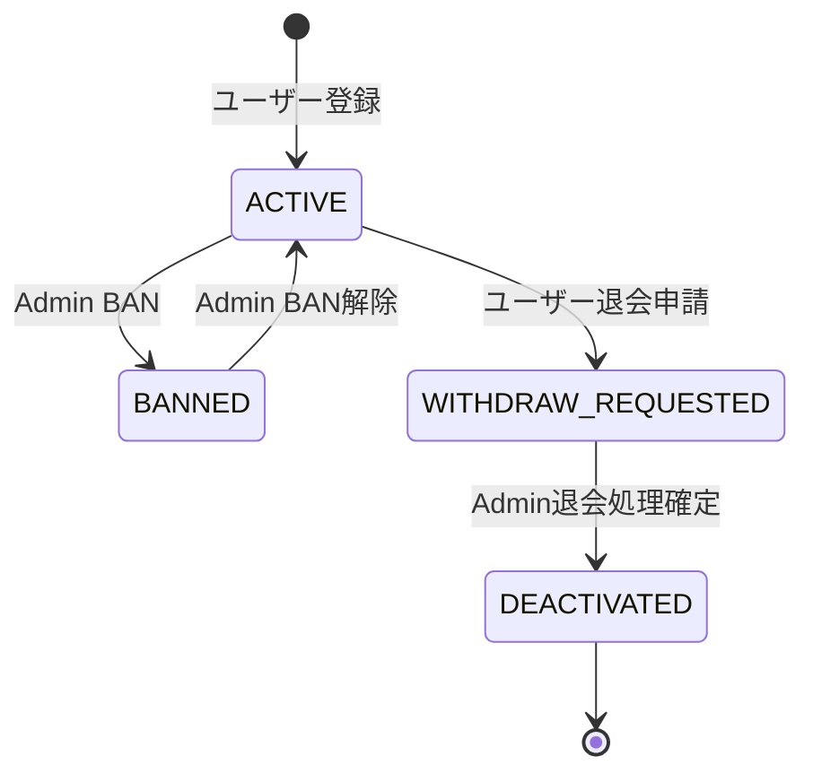
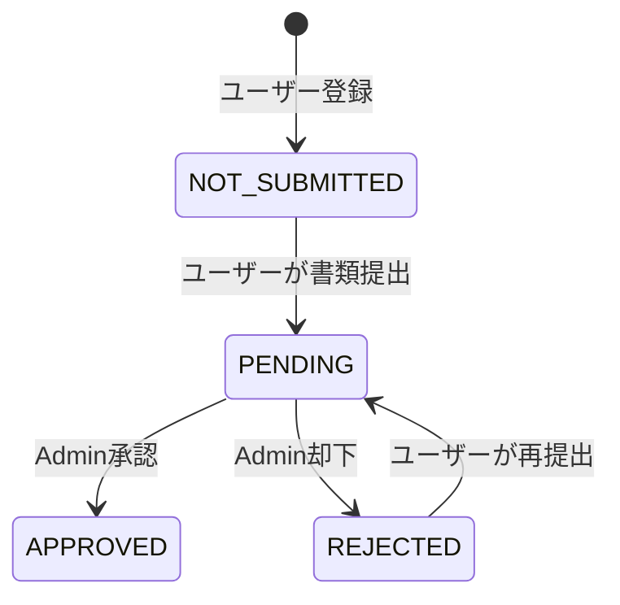
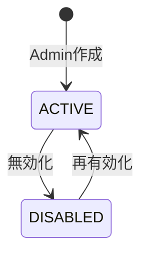
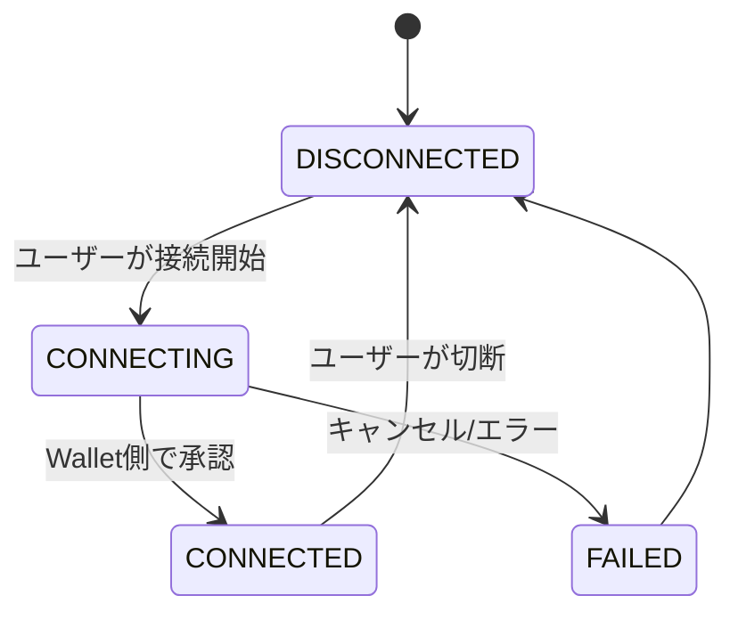

# Identity and Access

> Notion Source: https://www.notion.so/30f541c6043481a5b993f86c05fb1fdc

## 概要

ユーザーの登録・認証・KYC状態管理・退会・BAN、および管理者の認証を扱うドメイン。
ウォレット接続（Izakaya Wallet）もユーザーのIdentityに紐づく属性としてここで扱う。

---

## User

### U-01 ユーザー登録
- **目的**：アカウント作成（メール/パスワード）
- **前提**：なし
- **勝利フロー**
  1. クライアントが `email` と `password` を送信
  2. サーバーが `email` 形式と `password` ポリシーを検証
  3. `email` の重複を確認
  4. パスワードをハッシュ化して User を作成
  5. （方針により）トークン発行またはログイン画面へ誘導
- **例外フロー**
  - `email` 重複：409
  - 形式不正：422
- **結果**：User が作成される（ログイン可能）

---

### U-02 ログイン / ログアウト
- **目的**：認証してサービス利用
- **前提**：登録済み
- **勝利フロー（ログイン）**
  1. クライアントが `email` と `password` を送信
  2. サーバーが認証情報を検証
  3. トークン（JWT等）またはセッションを発行
  4. クライアントは以降 `Authorization` を付与してAPIを呼ぶ
- **勝利フロー（ログアウト）**
  1. クライアントがログアウトAPIを呼ぶ
  2. サーバーがセッション/トークンを無効化（方式次第）
- **例外フロー**
  - 認証失敗：401
- **結果**：ログインで認証状態が確立し、ログアウトで失効する

---

### U-02a パスワードリセット（AUTH-02）
- **目的**：パスワードを忘れたユーザーがリセットする
- **前提**：登録済み
- **勝利フロー**
  1. ユーザーが「パスワードを忘れた」→ メールアドレスを入力して送信
  2. サーバーが登録済みメールアドレスであることを確認
  3. リセットトークン付きURLをメール送信
  4. ユーザーがリセットリンクをクリック
  5. サーバーがトークンの有効性を検証（有効期限・使用済みチェック）
  6. ユーザーが新パスワードを入力
  7. サーバーがパスワードポリシーを検証
  8. パスワードをハッシュ化して更新
  9. 既存セッション（JWT）を無効化
  10. 監査ログに記録
- **例外フロー**
  - 未登録メール：200を返す（メール送信有無でユーザー存在を漏らさない）
  - トークン期限切れ/使用済み：422
  - パスワードポリシー不適合：422
- **結果**：パスワードが更新され、既存セッションが無効化される

---

### U-05 ウォレット接続（Izakaya Wallet）
- **目的**：受取先アドレス確定（Connected状態）
- **前提**：ログイン済み
- **勝利フロー**（概略：方式TBD）
  1. クライアントが「接続開始」を押し、Izakaya Walletへ遷移
  2. Wallet側で接続許可（Approve）
  3. アプリへコールバック（address等）または接続結果を受領
  4. サーバーがアドレス形式（0x…）とネットワーク（Polygon）を検証
  5. WalletAddress/WalletConnection を作成 or 更新（ACTIVE/CONNECTED）
  6. 接続済み状態（address, network）を返す
- **例外フロー**
  - ユーザーがキャンセル：409（またはOKで未接続のまま、方針固定）
  - address形式不正/ネットワーク違い：422
- **結果**：WalletAddress/WalletConnection が更新される（Connected）

---

### U-08 会員設定
- **目的**：メール/パスワード変更、退会申請
- **前提**：ログイン済み
- **勝利フロー（メール変更）**
  1. クライアントが新emailを送信
  2. 形式検証、重複検証
  3. User.email を更新
- **勝利フロー（パスワード変更）**
  1. クライアントが新password（必要なら現passwordも）を送信
  2. ポリシー検証、本人確認（方式次第）
  3. ハッシュ化して更新
- **勝利フロー（退会申請）**
  1. クライアントが退会申請を送信
  2. サーバーがガード条件を検証
     - 残高がゼロであること（残高がある場合は「先に出金してください」と案内）
     - 進行中の出金申請（`PENDING` / `APPROVED` / `PROCESSING`）がないこと
  3. User.status を `WITHDRAW_REQUESTED` に更新
  4. 管理者が退会処理を確定 → `DEACTIVATED`
- **例外フロー**
  - email重複：409
  - 形式不正：422
  - 残高が残っている：422（「先に出金してください」）
  - 進行中の出金申請あり：422
- **結果**：User情報が更新される／退会申請（または状態更新）が行われる

---

## Admin

### A-01 管理者ログイン
- **目的**：管理画面にアクセス
- **前提**：AdminUserが登録済み、管理画面が有効
- **勝利フロー**
  1. 管理者が `email/password`（または所定の認証情報）を入力して送信
  2. サーバーが認証情報を検証
  3. Admin用トークン（JWT等）またはセッションを発行
  4. 管理画面が認証状態でAPIアクセス可能になる
- **例外フロー**
  - 認証失敗：401
  - 無効化された管理者：403
- **結果**：AdminUserが認証され、以後の操作が監査ログの対象になる

---

### A-06 ユーザー管理
- **目的**：検索、BAN、没収（必要なら）
- **前提**：管理者ログイン済み
- **勝利フロー（検索）**
  1. 管理者が `user_id / email / name` 等で検索条件を入力
  2. サーバーが該当ユーザー一覧を返す（ページング）
  3. 管理者がユーザー詳細（連携口座、出金履歴、台帳など）を閲覧
- **勝利フロー（BAN）**
  1. 管理者が対象ユーザーに対してBANを実行し、理由を入力
  2. サーバーが User を `BANNED` に更新
  3. 監査ログに記録
- **勝利フロー（没収：やる場合）**
  1. 管理者が没収量（atomic）と理由を指定
  2. サーバーが台帳に没収（DEBITまたはCONFISCATE）を追記（追記型）
  3. 監査ログに記録
- **例外フロー**
  - 対象ユーザーなし：404
  - 入力不正（没収量など）：422
  - 停止スイッチ（没収を止める設計なら）：503
- **結果**：検索結果取得、BANでユーザー状態更新、没収する場合は台帳反映、いずれも監査ログが残る

---

## User（ユーザーアカウント）

### 状態フロー（User.status）

### 状態定義

| 状態 | 説明 |
|------|------|
| `ACTIVE` | 通常利用可能 |
| `BANNED` | 管理者による利用停止（主要操作禁止） |
| `WITHDRAW_REQUESTED` | ユーザーが退会申請済み、管理者の確認待ち |
| `DEACTIVATED` | 退会確定（ログイン不可） |

### BANの影響範囲
- 口座連携申請・出金申請・取引報酬の付与対象から除外
- BAN理由は必ず保持（監査ログ対象）
- BANユーザーは **ログイン可（読み取り専用）**: 残高確認・履歴閲覧のみ可能、出金・口座連携等の操作はすべてブロック

---

## KYC状態

出金のゲートとして機能する。Phase1ではKYCの本人確認フロー自体（画面/審査/外部連携）は最小構成（手動運用含む）。

### 状態定義

| 状態 | 説明 |
|------|------|
| `NOT_SUBMITTED` | 未提出（初期状態）。ユーザー登録直後はこの状態 |
| `PENDING` | 提出済み・審査中。ユーザーが書類提出後にこの状態へ遷移 |
| `APPROVED` | 承認済み（出金申請可能）。Admin承認後にこの状態へ遷移 |
| `REJECTED` | 却下（理由保持、再提出可能）。Admin却下後にこの状態へ遷移 |

### 状態遷移

### 遷移ガード条件

| 遷移 | ガード条件 |
|------|-----------|
| NOT_SUBMITTED → PENDING | ユーザーが書類を提出済み |
| PENDING → APPROVED | Admin操作（監査ログ必須） |
| PENDING → REJECTED | Admin操作（却下理由必須、監査ログ必須） |
| REJECTED → PENDING | ユーザーが書類を再提出 |

### ルール

- `kyc_status != APPROVED` のユーザーは出金申請をブロック（出金ゲート）
- KYC状態の更新は管理者が手動で行う（Phase1）
- 状態変更は監査ログ対象
- 却下理由はユーザーに通知する（アプリ内通知）

### 提出書類種別

Phase1では以下の本人確認書類を受け付ける：

| 書類種別 | 備考 |
|---------|------|
| 運転免許証 | |
| パスポート | |
| マイナンバーカード | |

### 各状態における画面表示要件

| 状態 | ユーザー画面の表示内容 |
|------|---------------------|
| `NOT_SUBMITTED` | 「本人確認が必要です」メッセージ + 書類種別選択 + アップロードフォーム |
| `PENDING` | 「審査中です」メッセージ + 進捗ステッパー（書類提出 → 審査中 → 完了）+ 審査期間目安（1〜3営業日） |
| `APPROVED` | 「本人確認が完了しました」メッセージ + 認証日・書類種類の表示 |
| `REJECTED` | 「本人確認が却下されました」メッセージ + 却下理由 + 再提出フォーム |

- 出金画面（Payout）への導線は、`APPROVED` 以外の状態ではブロックし、状態に応じたメッセージを表示する（AC-18）
  - `PENDING`：「現在審査中です。しばらくお待ちください。」
  - `NOT_SUBMITTED` / `REJECTED`：「本人確認書類を提出してください。」

### 画面との対応

- ユーザー画面 S-03: KYC状態表示、進捗ステッパー、未承認時の出金制限メッセージ
- 管理画面 A-03: KYC状態の確認・更新（監査ログ必須）

---

## AdminUser（管理者アカウント）

### 状態フロー

- MVPではAdminは**全権限**を持つ
- Viewer / Operator / Approver への分離は Phase2

---

## 認証

- JWT（Bearer Token）を基本方式とする
- User / Admin で `principal_type` を区別（`USER` / `ADMIN`）
- `BANNED` なUserはログイン可（読み取り専用モード）、`DEACTIVATED` なUserはログイン不可
- `DISABLED` なAdminはログイン不可
- ログアウト時のトークン無効化方式は下位設計で定義

---

## WalletConnection（ウォレット接続）

### 状態フロー

### 状態定義

| 状態 | 説明 |
|------|------|
| `DISCONNECTED` | 未接続（初期状態 or 切断後） |
| `CONNECTING` | 接続中（Izakaya Wallet側で承認待ち） |
| `CONNECTED` | 接続済み（address確定、出金可能） |
| `FAILED` | 接続失敗（ユーザーキャンセル or エラー） |

- Phase1では `network = POLYGON` 固定（識別子は `address` のみ）
- `CONNECTED` でなければ出金申請不可
- Izakaya Walletとの接続方式（OAuth/DeepLink等）は **未確定**（TBD-05）。クライアント側で実装docs準備中。確定次第反映。現時点の記載は暫定であり、最終仕様はクライアント提供docsに従う

---

## 処理フロー

### ユーザー登録（トランザクション内）
1. `email` 形式と `password` ポリシーを検証
2. `email` の重複を確認
3. パスワードをハッシュ化して User を作成（`status=ACTIVE`, `kyc_status=NONE`）
4. （方針により）トークン発行またはログイン画面へ誘導

### ログイン（トランザクション内）
1. `email` と `password` で認証情報を検証
2. User.status が利用可能であることを確認
3. JWT を発行して返却

### BAN（トランザクション内）
1. 管理者が対象ユーザーとBAN理由を指定
2. User.status = `BANNED` に更新
3. 監査ログに記録

### BAN解除（トランザクション内）
1. 管理者が解除を実行
2. User.status = `ACTIVE` に戻す
3. 監査ログに記録

### 退会フロー
1. 退会申請のガード条件を検証
   - 残高がゼロであること（残高がある場合は「先に出金してください」と案内し、申請をブロック）
   - 進行中の出金申請（`PENDING` / `APPROVED` / `PROCESSING`）がないこと
2. ユーザーが退会申請 → `WITHDRAW_REQUESTED`
3. 管理者が退会処理を確定 → `DEACTIVATED`
4. 監査ログに記録

### パスワードリセット（AUTH-02）
1. ユーザーが「パスワードを忘れた」→ メールアドレスを入力
2. 登録済みメールアドレスであればリセットトークン付きURLをメール送信
3. ユーザーがリセットリンクをクリック → トークンの有効性を検証（有効期限・使用済みチェック）
4. 新パスワードを入力 → パスワードポリシーを検証
5. パスワードをハッシュ化して更新
6. 既存セッション（JWT）を無効化
7. 監査ログに記録

### ウォレット接続（概略：方式TBD）
1. ユーザーが「接続開始」を押し、Izakaya Walletへ遷移
2. Wallet側で接続許可（Approve）
3. アプリへコールバック（address等）または接続結果を受領
4. アドレス形式（0x…）とネットワーク（Polygon）を検証
5. WalletConnection を `CONNECTED` に更新

---

## 管理画面（見せたいもの）

### ユーザー管理
- ユーザー一覧（メール / 状態 / KYC状態 / ランク / Wallet接続状態 / 登録日）
- 状態フィルタ（ACTIVE / BANNED / WITHDRAW_REQUESTED / DEACTIVATED）
- ユーザー詳細（プロフィール / 状態履歴 / KYC状態 / Wallet接続 / 口座連携 / 残高）
- BAN / BAN解除操作（理由入力必須）
- 退会処理の確定
- KYC状態の手動更新（NONE → PENDING → APPROVED / REJECTED）
- ランクの割当・変更（USR-02）

### 管理者管理
- Admin一覧（メール / 状態 / 作成日）
- Admin作成 / 無効化 / 再有効化

---

## 通知

| イベント | ユーザー通知 |
|---------|-------------|
| BAN | アプリ内（理由付き） |
| BAN解除 | アプリ内 |
| 退会確定 | - |
| KYC承認 | アプリ内 |
| KYC却下 | アプリ内（理由付き） |

---

## 不変条件（Invariants）

1. **email一意性**: email は全体で一意
2. **パスワード保存**: 平文保存禁止、ハッシュ化必須
3. **状態遷移の正当性**: 定義外の遷移は不可（例：`DEACTIVATED` → `ACTIVE` は不可）
4. **KYCゲート**: `kyc_status != APPROVED` のユーザーは出金申請不可
5. **Walletゲート**: `CONNECTED` でないユーザーは出金申請不可

---

## 決定済み事項

- Phase1は User / Admin の2ロール
- KYC未完了ユーザーの出金をブロックする
- ランクは月次バッチで自動昇格・降格（BR-10）。閾値等はマスター管理で運営が変更可能。Adminによる手動上書きも可能（USR-02）
- ウォレットは Izakaya Wallet のみ、Polygon固定
- BANユーザーはログイン可（読み取り専用: 残高確認・履歴閲覧のみ）
- 退会は残高ゼロ + 進行中の出金申請なしが前提条件
