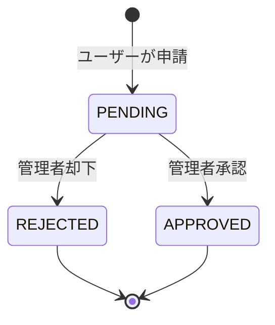

# Broker Integration and Account Linking

> Notion Source: https://www.notion.so/30f541c60434810d9be9d5ed966905a0

## 概要

提携ブローカーの管理と、ユーザーのMT4/MT5口座を連携する申請・承認ワークフローを扱うドメイン。
承認された口座は FXAccount として登録され、CSV取込時にユーザーと取引データを紐づける起点となる。

---

## ユースケース

### B-01 ブローカーマスター管理
- **目的**：提携ブローカー追加/編集/有効無効
- **前提**：Adminログイン済み
- **勝利フロー（追加）**
  1. 管理者がブローカー情報（name/code、表示名、アフィURL等）を入力して送信
  2. サーバーが必須項目・形式を検証
  3. ブローカーを作成（`is_active=true` など初期状態を設定）
  4. 監査ログに記録
  5. 作成結果を返す
- **勝利フロー（編集/有効無効）**
  1. 管理者が対象ブローカーを選び、項目更新または `is_active` を切替
  2. サーバーが更新内容を検証
  3. Broker を更新
  4. 監査ログに記録
  5. 更新結果を返す
- **例外フロー**
  - 権限不足：403
  - 入力不正：422
  - 競合/重複（code重複等）：409
- **結果**：Broker が作成/更新され、監査ログが残る

---

### B-02 FX口座連携申請の登録
- **目的**：ユーザーのMT4/MT5口座を申請として受け付け
- **前提**：Userログイン済み、（必要なら）口座連携受付が停止されていない
- **勝利フロー**
  1. ユーザーがブローカーを選択し、口座番号（MT4/MT5）を入力して送信
  2. サーバーが `broker_id` が有効（存在/active）か検証
  3. サーバーが口座番号形式を検証（桁数/文字種など）
  4. AccountLinkRequest を `PENDING` で作成（requestedAtを記録）
  5. 作成結果（request_id, status）を返す
- **例外フロー**
  - 無効なブローカー：422
  - 形式不正：422
  - 停止スイッチON：503
  - 既に同一口座で `PENDING` がある場合：409（方針により許可/禁止を固定）
- **結果**：AccountLinkRequest（PENDING）が作成される

---

### B-03 申請の審査（重複チェック含む）
- **目的**：重複口座アラート、承認/却下判断
- **前提**：Adminログイン済み、対象申請が `PENDING`
- **勝利フロー（重複チェック）**
  1. 管理者が申請詳細を開く
  2. サーバーが同一 `broker_id x account_number` の既存データを検索
  3. 重複があれば「重複アラート」を表示できる情報を返す（件数、対象IDなど）
- **勝利フロー（承認）**
  1. 管理者が「承認」を実行
  2. サーバーが申請ステータスが `PENDING` であることを確認
  3. （重複がある場合）方針に従い処理
     - 原則：承認不可にして拒否（409）
     - または：警告表示の上で承認可能（方針固定）
  4. AccountLinkRequest を `APPROVED` に更新（approvedAt、approvedByを記録）
  5. FXAccount を作成（user_id, broker_id, account_number, status=ACTIVE など）
  6. 監査ログに記録
  7. 更新結果を返す
- **勝利フロー（却下）**
  1. 管理者が「却下」を実行し `reject_reason` を入力して送信
  2. サーバーが申請ステータスが `PENDING` であることを確認
  3. AccountLinkRequest を `REJECTED` に更新し、理由を保存
  4. 監査ログに記録
  5. 更新結果を返す
- **例外フロー**
  - `PENDING` 以外に承認/却下：409
  - `reject_reason` 未入力：422
  - 重複口座で承認不可方針の場合：409
- **結果**：承認なら FXAccount が作成され、却下なら理由付きで REJECTED となり、監査ログが残る

---

### B-04 連携済み口座一覧の参照
- **目的**：ユーザーに紐づく口座を確認
- **前提**：ログイン済み（UserまたはAdmin）
- **勝利フロー（User）**
  1. ユーザーが「連携済み口座一覧」を開く
  2. サーバーがユーザー本人に紐づく FXAccount を取得
  3. 一覧を返す（必要ならページング）
- **勝利フロー（Admin）**
  1. 管理者がユーザー詳細画面で口座一覧を要求（user_id指定）
  2. サーバーが対象ユーザーの FXAccount を取得して返す
- **例外フロー**
  - 権限不足（他人の口座をUserが見る）：403
  - 対象ユーザーなし（Admin）：404
- **結果**：FXAccount 一覧が取得できる

---

## Broker（ブローカーマスター）

- `broker_code` は一意（例：`XM`, `FXGT`）
- 有効/無効の切替が可能（無効なブローカーでは口座連携申請を受け付けない）
- アフィリエイトURL（口座開設誘導用）を保持
- 初期登録は **IBログインリスト** を基準（BR-07）
- CSV取込対象は **マスター登録済み＋有効** な業者に限定
- 作成/編集/有効無効切替は監査ログ対象
- **機密情報（ID/Password等）は仕様書に記載しない**（別管理）

---

## AccountLinkRequest（口座連携申請）

### 状態フロー

### 状態定義

| 状態 | 説明 |
|------|------|
| `PENDING` | ユーザーが申請済み、管理者の承認待ち |
| `APPROVED` | 承認済み → FXAccount が作成される |
| `REJECTED` | 却下（理由保持、再申請可能） |

### ガード条件

| 遷移 | ガード条件 |
|------|-----------|
| `[*] → PENDING` | ブローカーが有効（`is_active=true`）、口座連携受付停止OFF |
| `PENDING → APPROVED` | 重複チェック通過（方針に従う） |
| `PENDING → REJECTED` | `reject_reason` 必須 |

---

## FXAccount（連携済み口座）

- 承認時に作成される。ユーザー・ブローカー・口座番号の紐付けを保持
- `(broker_id, account_number)` の組み合わせで一意
- `ACTIVE` / `INACTIVE` の状態を持つ
- `ACTIVE` な口座のみが取引集計・付与計算の対象（BR-01）
- CSV取込時に `broker_account_id` → `user_id` の紐付けに使用（Trade Import ドメインの入力）
- MT4 / MT5 の両プラットフォームに対応

---

## 重複口座の検知

口座連携申請の審査時、同一 `broker_id × account_number` で既に登録がある場合にアラートを表示する。

### 検知ルール
- 既に FXAccount に同一 `(broker_id, account_number)` が存在する
- または AccountLinkRequest に同一組み合わせで `PENDING` / `APPROVED` が存在する

### 管理者の対応
- 管理画面に「重複アラート」を表示（対象件数、既存の所有者情報）
- 原則：重複口座の承認は不可（却下）
- 例外対応が必要な場合は方針を固定する

---

## 処理フロー

### 口座連携申請（トランザクション内）
1. ユーザーが `broker_id` と `account_number`（MT4/MT5）を送信
2. ブローカーの有効性（存在 / `is_active`）を検証
3. 口座番号の形式を検証（桁数/文字種など）
4. 同一口座で `PENDING` の申請が既にないか確認（方針により許可/禁止）
5. AccountLinkRequest を `PENDING` で作成

### 承認（トランザクション内）
1. 管理者が対象申請を選び「承認」を実行
2. 申請ステータスが `PENDING` であることを確認
3. 重複チェック（同一 `broker_id × account_number` の既存データ検索）
   - 重複あり → 方針に従い拒否 or 警告表示の上で承認可能
4. AccountLinkRequest を `APPROVED` に更新（承認者、承認日時を記録）
5. FXAccount を作成（`status=ACTIVE`）
6. 監査ログに記録

### 却下（トランザクション内）
1. 管理者が「却下」を実行し、`reject_reason` を入力して送信
2. 申請ステータスが `PENDING` であることを確認
3. AccountLinkRequest を `REJECTED` に更新、理由を保存
4. 監査ログに記録

### 口座無効化（トランザクション内）
1. 管理者が FXAccount を `INACTIVE` に更新
2. 以降の取引集計・付与計算の対象から除外
3. 監査ログに記録

---

## 管理画面（見せたいもの）

### 口座連携申請一覧
- 状態別フィルタ（PENDING / APPROVED / REJECTED）
- ユーザー名 / ブローカー / 口座番号 / 申請日 / 審査者
- 重複アラート表示

### ユーザー詳細画面内の口座タブ
- 連携済み口座一覧（ブローカー / 口座番号 / プラットフォーム / 状態）
- 申請履歴

### ブローカーマスター管理
- 一覧（code / 表示名 / 有効/無効 / アフィリエイトURL）
- 追加 / 編集 / 有効無効切替

---

## 通知

| イベント | ユーザー通知 |
|---------|-------------|
| 口座連携申請受付 | アプリ内 |
| 口座連携承認 | アプリ内：口座連携が承認されました |
| 口座連携却下 | アプリ内：口座連携が却下されました（理由付き） |

---

## 不変条件（Invariants）

1. **口座一意性**: `(broker_id, account_number)` の組み合わせで FXAccount は一意
2. **還元対象の前提**: `APPROVED` かつ `ACTIVE` な FXAccount のみが取引集計・付与計算の対象（BR-01）
3. **却下理由必須**: `REJECTED` への遷移時は `reject_reason` を必ず保持
4. **ブローカー有効性**: `is_active=false` のブローカーでは新規の口座連携申請を受け付けない
5. **監査追跡**: 承認/却下/ブローカー設定変更は全て監査ログに記録

---

## 決定済み事項

- 口座連携は申請→管理者承認の手動ワークフロー（Phase1）
- MT4 / MT5 の両プラットフォームに対応
- ブローカー初期登録はIBログインリスト基準（BR-07）
- 重複口座は原則承認不可
