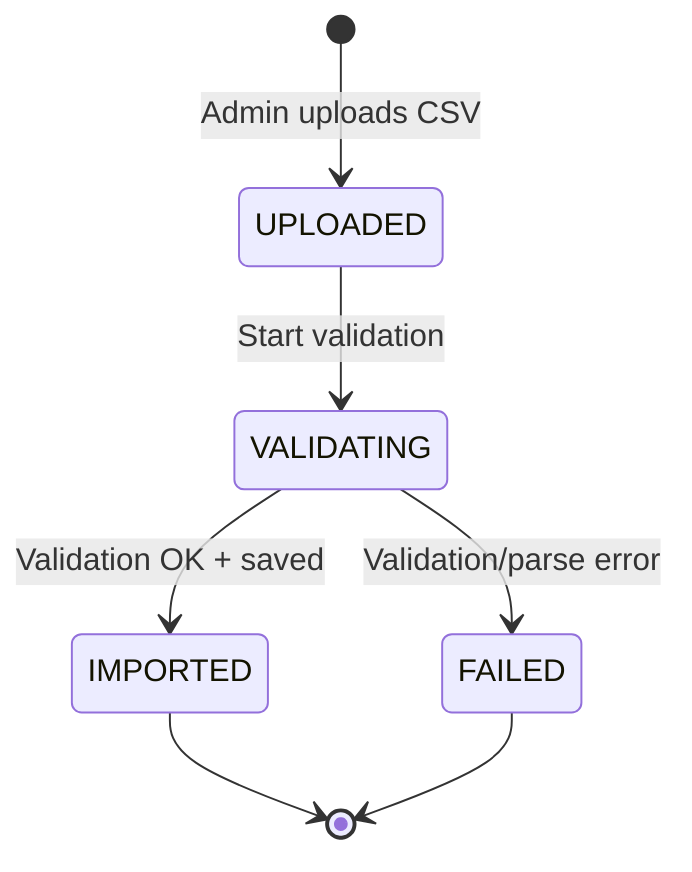
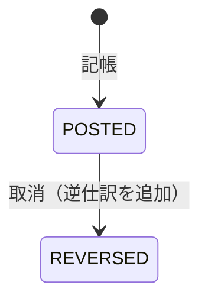

# Trade Import and Reward Ledger

> Notion Source: https://www.notion.so/30f541c60434815284d4ee2e3baaf879

## 概要

ブローカーから受領した月次CSVを取り込み、**ユーザーごとの原資 `R`（USD）** を確定して保存するドメイン。
この `R` は後続の Rewards（計算・配分・台帳計上）の入力になる。

**責務の境界**: このドメインは「CSVアップロード → バリデーション → ユーザー紐付け → 原資R確定」まで。確定後のR を用いた計算・配分・台帳計上は **Rewards ドメイン** の責務。

---

## ユースケース

### U-03 ダッシュボード閲覧
- **目的：** 総保有KQ、円換算、次回付与日、推移グラフを確認
- **前提：** ログイン済み
- **勝利フロー**
  1. クライアントがダッシュボード取得APIを呼ぶ
  2. サーバーがユーザーの台帳（Ledger）から残高/推移の計算に必要なデータを取得
  3. 参考レート（本日のレート）を取得し円換算を計算
  4. 次回付与日（付与周期ルールに基づく）を算出
  5. 集計結果（残高、円換算、推移、次回付与日）を返す
- **例外フロー**
  - レート未設定の場合：円換算を非表示/0/`rate_missing` を返す（方針固定）
- **結果：** Balance（計算結果）と履歴表示に必要な情報が返る

---

### T-01 取引履歴CSVインポート
- **目的：** 管理者がCSVをアップロードし取込
- **前提：** Adminログイン済み、取込停止スイッチOFF、対象ブローカーが有効
- **勝利フロー**
  1. 管理者がブローカーを選択し、取引履歴CSVをアップロード
  2. サーバーがファイル基本検証（サイズ/拡張子/文字コード方針）
  3. TradeImport を作成（status=UPLOADED/VALIDATING、actor、日時を記録）
  4. CSVの解析・検証処理を開始（同期/非同期は方針固定）
  5. 検証結果を TradeImport に反映（IMPORTED/FAILED、件数、エラー件数など）
  6. 取込結果（status、件数、エラー概要）を返す
- **例外フロー**
  - 停止スイッチON：503
  - 無効なブローカー：422
  - ファイル不正（形式/サイズ）：422
- **結果：** TradeImport が作成され、取込結果（成功/失敗/件数）が保存される

---

### T-02 取引データの検証・整形
- **目的：** 必須カラム/形式チェック、重複検知
- **前提：** TradeImport が存在し、解析処理が実行される（T-01の内部処理として扱ってOK）
- **勝利フロー**
  1. サーバーがCSVを行単位で読み込み
  2. 必須カラムの存在と型/形式（日時、口座番号、ロットなど）を検証
  3. 正規化（例：数値のパース、日時正規化、口座番号整形）
  4. 重複判定キーに基づき重複を検知（重複の扱いは方針固定：除外/上書き/エラー）
  5. TradeRecord を保存（保存する設計の場合）または集計用の中間データを生成
  6. エラーがある場合は ImportError として行番号・理由を記録し、TradeImport にサマリを反映
- **例外フロー**
  - 必須カラム欠落：TradeImport=FAILED（422相当の理由を保存）
  - 行の一部だけ不正：部分成功を許可するか、全体失敗にするかを方針固定
- **結果：** TradeRecord（必要なら）が保存され、エラー記録が残る／または取込失敗として記録される

---

### T-03 原資確定（ユーザー別IB報酬の確定）
- **目的：** CSVから集計したユーザー別IB報酬（原資R）をAdminが確認・確定する
- **前提：** 対象月の取込データが存在（TradeImport=IMPORTED）、口座→ユーザー紐付け（FXAccount）が確定している
- **勝利フロー**
  1. 管理者が対象月のTradeImport（IMPORTED）を選択
  2. サーバーがCSVの「アフィリエイト報酬」列からユーザー別IB報酬を集計
  3. 口座→ユーザーの紐付け（FXAccount / BR-01）に基づき、ユーザー別に原資Rを算出
  4. 原資入力欄にプリフィル表示
  5. 管理者が原資額を確認（必要なら修正）して確定
  6. ユーザー × 月の原資R（USD）を保存
  7. 監査ログに記録
- **例外フロー**
  - 対象月のデータなし：空結果を返す
  - 紐付け未解決の行がある場合：除外してログに記録（紐付け済み行のみで継続）
- **結果：** ユーザー別原資R（USD）が確定され、Rewards（付与計算）の入力として利用可能になる

---

### T-06 台帳（増減履歴）の参照/出力
- **目的：** 「誰に・いつ・いくら」を説明可能にする
- **前提：** ログイン済み（Userは自分のみ、Adminは全件可）
- **勝利フロー（参照）**
  1. クライアントが台帳一覧APIを呼ぶ（type/期間/page/sort）
  2. サーバーが権限に応じて対象範囲の LedgerEntry を取得
  3. ページング情報とともに一覧を返す
- **勝利フロー（CSV出力）**
  1. クライアントがCSV出力APIを呼ぶ（期間など指定）
  2. サーバーが対象LedgerEntryを抽出してCSV生成
  3. CSVを返す
- **例外フロー**
  - 範囲が大きすぎる：422（上限を設ける場合）
- **結果：** LedgerEntry の一覧取得とCSV出力が可能

---

### U-07 履歴閲覧（付与/出金）＋CSV出力
- **目的：** Ledger/Withdrawal履歴を確認・出力
- **前提：** ログイン済み
- **勝利フロー（閲覧）**
  1. クライアントが履歴一覧APIを呼ぶ（ページング/期間/種別フィルタ）
  2. サーバーがユーザー本人の履歴のみ取得（台帳・出金）
  3. ページング情報とともに一覧を返す
- **勝利フロー（CSV出力）**
  1. クライアントがCSV出力APIを呼ぶ（期間など指定）
  2. サーバーが対象データを抽出しCSV生成
  3. CSVを返す（ダウンロード）
- **例外フロー**
  - 範囲が大きすぎる：422（上限を設ける場合）
- **結果：** 一覧表示/CSV出力が可能

---

## 入力データ（CSVの最低限）

- 対象月（例：`2026-02`）
- ブローカー識別子（例：`XM`）
- ブローカー口座ID（MT4/MT5等）
- IB報酬原資（USD）

（ユーザーIDをCSVに含めるならそれでもOK。ただし"口座→ユーザー紐付け"が正なら、口座IDから引けるのが自然）

---

## 状態フロー（TradeImport）

### 状態定義

| 状態 | 説明 |
|------|------|
| `UPLOADED` | ファイル受領済み |
| `VALIDATING` | CSV構造チェック・ユーザー紐付け処理中 |
| `IMPORTED` | ユーザー別の原資 `R` を保存済み |
| `FAILED` | 取込失敗（原因保持） |

### ガード条件

| 遷移 | ガード条件 |
|------|-----------|
| `[*] → UPLOADED` | ブローカーが有効（`is_active=true`）、ファイル形式がCSV |
| `UPLOADED → VALIDATING` | 自動遷移（アップロード後に即時開始） |
| `VALIDATING → IMPORTED` | CSV構造OK、必須列OK、紐付け済み行でユーザー別原資R確定済み（未紐付け行は除外してログ記録）、二重取込チェック通過 |
| `VALIDATING → FAILED` | パースエラー、必須列欠落、紐付け未解決、重複検出 |

---

## 処理フロー

### 1. CSVアップロード
1. AdminがCSVファイルをアップロード → TradeImport を `UPLOADED` で作成
2. `VALIDATING` に自動遷移し、以下を検証:
   - CSV形式チェック（パース、必須列、型）
   - 二重取込防止チェック（同一月 × 同一ブローカー × 同一ソースの重複は拒否）

### 2. ユーザー紐付け
1. 各行の `broker_account_id` からユーザーを引く（FXAccount 参照、BR-01）
2. 紐付けできない行がある場合:
   - 未紐付け行は **除外（スキップ）** して、紐付けできた行だけで処理を継続
   - 除外された行はログに記録し、管理画面で確認可能とする

### 3. 原資確定
1. 全行のユーザー紐付けが完了
2. トレーダー名（口座紐付け）でIB報酬を集計 → **原資入力欄にプリフィル**
3. Adminが原資額を **確認/変更** して確定する（BR-08）
4. ユーザー × 月の原資 `R` を保存
5. `IMPORTED` に更新

---

## Reward Ledger（台帳）

### 概要

報酬の付与・取消などの金額変動を、**改ざんしない形で記録する台帳**。残高の真実（Source of Truth）。
Trade Import が確定した `R` や Reward 計算結果を参照して、Ledger に記録される。

### 台帳の基本（概念）

- **LedgerAccount（財布）**
  - `USER`（ユーザー別）
  - `BUYBACK`
  - `OPS`
- **Asset（通貨）**: BTC / USDT / ETH / KQ 等
- **LedgerEntry**（entry_type）
  - `CREDIT`（付与・加算）
  - `DEBIT`（出金・減算）
  - `REVERSAL`（取消・逆仕訳）

### 状態フロー（LedgerEntry）

台帳は「状態遷移」より「追記」で運用する。

| 状態 | 説明 |
|------|------|
| `POSTED` | 記帳済み（残高に反映される） |
| `REVERSED` | 取消済み（逆仕訳が追加された状態） |

### 台帳に必須のキー（BR-09）

| キー | 用途 |
|------|------|
| `batch_id` | 取込バッチID |
| `target_month` | 対象月 |
| `account_id` | 対象口座ID |
| `dedupe_key` | 冪等キー（`batch_id + user_id + entry_type` 等） |

### 台帳の処理フロー

### 記帳（トランザクション内）
1. 参照元（RewardComputation / Withdrawal / Adjustment）を指定
2. **idempotency**（同一参照で同じ記帳を二重に作らない）をチェック
3. `LedgerEntry` を追加（`CREDIT/DEBIT`）
4. （必要なら）残高キャッシュを更新

### 取消（トランザクション内）
1. 元の `LedgerEntry` を特定
2. 逆仕訳（符号反転のEntry）を追加
3. 元Entryを `REVERSED` 扱いにする（削除しない）

---

## 管理画面（見せたいもの）

### Trade Import
- ImportBatch一覧（対象月 / ブローカー / 状態 / 合計R / 行数 / 失敗数）
- Batch詳細
  - 行一覧（口座ID / user / R / 紐付け状態 / エラー）
  - 未紐付け行の解決UI（「この口座はこのユーザー」）
- **ユーザー別原資ビュー**
  - 対象月の `R` をユーザーごとに一覧（検索・CSV出力）

### Reward Ledger
- **ユーザー別台帳ビュー**
  - 期間・通貨でフィルタ
  - 合計残高、入出金/付与の明細（参照元リンク付き）
- Buyback / Ops の台帳ビュー
- 参照元別の検索（「この月の報酬計上だけ見たい」など）

---

## 通知

| イベント | ユーザー通知 |
|---------|-------------|
| CSV取込完了（IMPORTED） | なし（管理者向け） |
| CSV取込失敗（FAILED） | なし（管理者向けアラート） |

---

## 不変条件（Invariants）

### Trade Import
1. **二重取込禁止**: 同一ソースの同一月データは重複保存しない
2. **紐付け不可行の除外記録**: 紐付けできない行は除外（スキップ）し、除外行はログに記録。紐付け済み行のみで原資確定する
3. **RはUSDの最小単位整数で保持**（小数は持たない）

### Reward Ledger
1. **削除しない**: 取消は必ず逆仕訳
2. **二重記帳禁止**: `reference_type + reference_id + entry_type(+asset)` で一意（dedupe_key）
3. **金額は最小単位整数**
4. **残高は台帳の合計が真実**（キャッシュは派生）

---

## 決定済み事項

- CSVの「アフィリエイト報酬」列からユーザー別IB報酬を集計し、原資入力欄にプリフィル→Admin確定
- 原資Rの確定までがこのドメインの責務。計算・配分・台帳計上はRewardsドメインの責務
- 台帳は追記型（不変）。修正は取消/調整で表現（BR-09）
- 紐付け不可能な行は除外（スキップ）して、紐付けできた行だけで継続。除外行はログに記録
