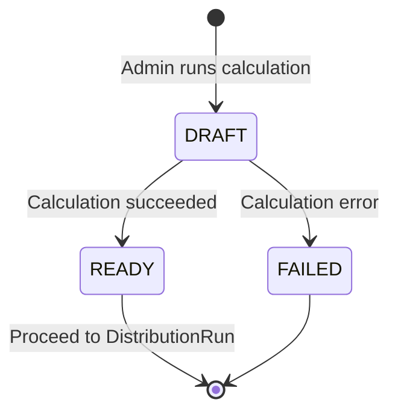
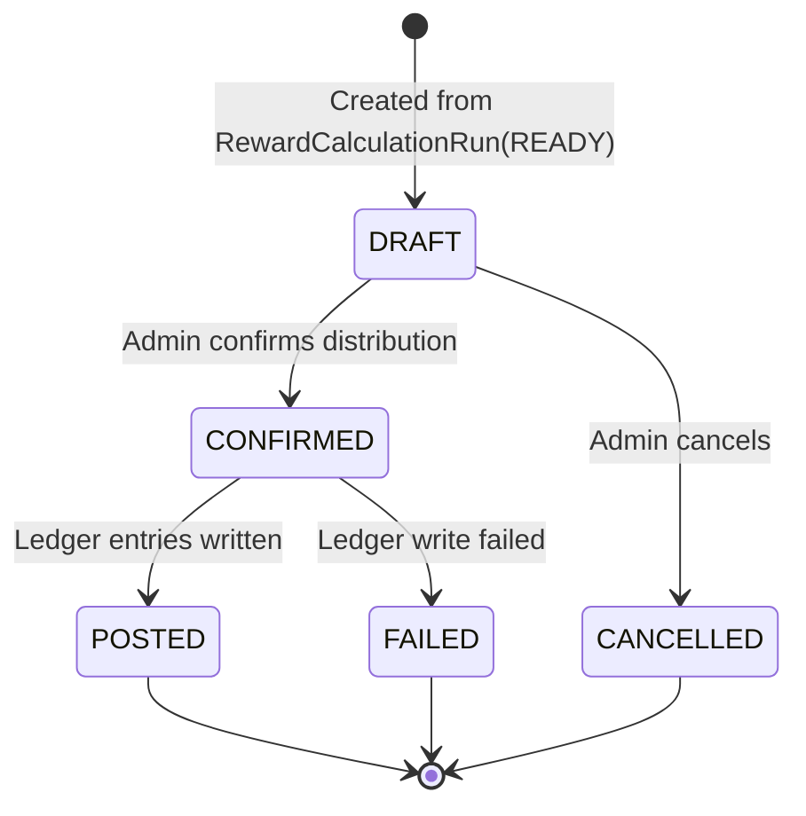

# Rewards

> Notion Source: https://www.notion.so/315541c6043480a4998cd4b98a669409

## 概要

Trade Import で確定したユーザー別IB報酬（原資 `R`）を入力として、**還元率・ランク倍率・キャンペーン倍率・配分比率・参考レート** を適用し、アセット別の付与量を計算・確定・台帳計上するドメイン。

**責務の境界**: CSV取込→原資R確定までは Trade Import の責務。本ドメインは「確定済みRを受け取ってからの計算・配分・台帳計上」を担う。

---

## ユースケース

### T-04 付与計算（RewardCalculationRun）
- **目的：** 確定済み原資Rから付与量を計算し、プレビューを生成する
- **前提：** 対象月の原資R確定済み（T-03）、還元率・配分比率・参考レートが設定済み
- **勝利フロー**
  1. 管理者が対象月を選択し「計算実行」を押す
  2. RewardCalculationRun を `DRAFT` で作成
  3. 対象月の確定済み原資Rを取得
  4. 還元対象口座（BR-01）に対し、除外条件を適用
  5. ユーザーごとに付与量を計算（BR-08）
     - `ユーザー別IB報酬 × 還元率 × ランク倍率（BR-10） × キャンペーン倍率（BR-11）`
     - → 配分比率で各アセットに按分（BR-06）
     - → 参考レートでアセット数量に変換
     - → 端数処理（D-03）
  6. 整合性チェック（配分比率合計100%、レート設定済み等）
  7. 上限/異常判定（BR-05）
  8. 計算成功 → `READY`（プレビュー確認可能） / 失敗 → `FAILED`
  9. 管理者がユーザー別×アセット別の付与量をプレビュー確認
- **例外フロー**
  - 還元率/配分比率/参考レート未設定：409（前提不足、`FAILED`）
  - 配分比率合計≠100%：422
  - 上限超過：アラート生成（手動承認が必要）
- **結果：** RewardCalculationRun（READY）が作成され、付与量プレビューが確認できる

---

### T-05 付与確定（DistributionRun）
- **目的：** 計算結果を確定し、台帳に書き込む
- **前提：** 管理者ログイン済み、付与停止スイッチOFF、RewardCalculationRun が `READY` 状態
- **勝利フロー**
  1. 管理者が READY 状態の RewardCalculationRun を選択し「付与確定」を押す
  2. DistributionRun を `DRAFT` で作成（計算結果から生成）
  3. 管理者がプレビューを最終確認
  4. 二重付与防止チェック（BR-09: `dedupe_key`）
  5. 管理者が「確定」→ `CONFIRMED`
  6. ユーザー別×アセット別に LedgerEntry（CREDIT）を作成
  7. 全書込成功 → `POSTED`（残高反映完了）
  8. 監査ログに「付与確定」を記録
  9. 実行結果（件数・総付与量）を返す
- **例外フロー**
  - 二重付与に該当（dedupe_key重複）：409
  - 付与停止スイッチON：503
  - 台帳書込失敗：全体ロールバックして `FAILED`（500）
- **結果：** DistributionRun が `POSTED` となり、LedgerEntry（CREDIT）が追記され残高に反映される

---

## 付与計算モデル（BR-08）

### ステップ1：ユーザー還元原資の算出

`ユーザー還元原資 = ユーザー別IB報酬 × 還元率 × ランク倍率（BR-10） × キャンペーン倍率（BR-11）`

### ステップ2：アセット別付与量の算出

```
各アセット付与額 = ユーザー還元原資 × 配分比率（BR-06）
各アセット付与量 = floor(各アセット付与額 / 参考レート × 10^token_decimals)
```

### 端数処理（D-03）
- KQトークン：**1 KQトークン単位**（1未満切り捨て）
- その他の通貨：**token_decimalsに従い最小単位で切り捨て**（USD評価）

### 計算例（ユーザーA）
- ユーザー別IB報酬（CSV集計→Admin確定）: $100
- 還元率: 20%、ランク倍率: 1.0、キャンペーン倍率: 1.5（春キャンペーン）
- ユーザー還元原資: $100 × 20% × 1.0 × 1.5 = **$30**
- 配分：BTC 40% / USDT 30% / ETH 20% / KQ 10%
  - BTC $12 / USDT $9 / ETH $6 / KQ $3（合計 $30）

### Phase1 初期登録アセット（確定：9種）

`BTC` / `ETH` / `XRP` / `USDT` / `USDC` / `JPYR` / `JPYC` / `IZAKAYA` / `KQ`

> 上記計算例は4種で簡略化しているが、Phase1では9種すべてに配分比率を設定する。

---

## ランク倍率ルール（BR-10）

ユーザーにはランクが付与され、ランクに応じて **還元率倍率** が変動する。
昇格判定は **累計獲得報酬USD（LEV_USD）** を用いる。降格は **90日取引なし**（非アクティブ）時のみ行う。

### 用語（ランク母数）
- **LEV_USD**：Lifetime Earned Value in USD
  - `LEV_USD = Σ signed_value_usd_at_grant`
  - 付与確定時点のUSD評価額を台帳に固定保存し、価格変動で再評価しない
- `last_trade_at`：CSV取込により更新される最終取引日時

### ランク倍率テーブル（マスター管理：RNK-01）

| ランク名 | 還元率倍率 | LEV_USD閾値 |
|---------|-----------|------------|
| Member（デフォルト） | 1.0 | — |
| Silver | 1.5 | $X |
| Gold | 2.0 | $Y |

- `effective_from`（適用開始日）を持ち、将来適用のみ
- `version` で変更履歴を保持

### 昇格条件（自動）
- 月次判定時点で、`LEV_USD` が閾値以上なら到達可能な最高ランクに更新

### 降格条件（自動）
- 月次判定時点で `last_trade_at` が **90日以上更新なし** の場合、**1段階降格**（Gold → Silver → Member）

### 判定タイミング
- **月次バッチ** で実施（例：毎月1日）
- デフォルトは Member（倍率1.0）

### 閾値マスター変更ルール
- 閾値は運営がマスター画面で変更可能
- 変更は `effective_from` を持ち **将来適用のみ（遡及しない）**
- 変更は **監査ログ必須（理由必須）**

### 適用ルール
- 付与量計算時に、ユーザーの **現在ランク** の倍率を適用
- ランク変更は監査ログ対象

---

## キャンペーン倍率ルール（BR-11）

キャンペーンにより、対象ユーザーの付与計算時に **追加倍率** を適用する。

### キャンペーン種別

| 種別 | 例 | 対象 |
|------|---|------|
| 期間限定（全体） | 春のキャンペーン：期間中の全ユーザーに1.5倍 | 全対象ユーザー |
| 入会特典（個別） | 入会から1ヶ月間はxx%UP | 条件を満たすユーザー個別 |

### キャンペーンマスター（CMP-01）

| 項目 | 内容 |
|------|------|
| キャンペーン名 | マスターで定義 |
| 倍率 | キャンペーンごとに設定（例：1.5） |
| 期間 | 開始日 / 終了日 |
| 対象条件 | 全体 or ユーザー個別（入会日起算等） |

### 適用ルール
- 付与計算時に、対象ユーザーの **有効なキャンペーン倍率** を適用
- 複数キャンペーンが重複する場合は **最大値を採用**（例: 1.5倍と1.3倍なら1.5倍を適用）
- キャンペーン倍率が未設定のユーザーは **1.0**（通常倍率）
- キャンペーンの作成/変更は監査ログ対象

---

## 整合性チェック（付与確定の前提条件）

| チェック項目 | 不備時の動作 |
|------------|-------------|
| 対象月の原資額（IB報酬）が確定済み | 付与確定不可 |
| 還元率が設定済み | 付与確定不可 |
| 配分比率の合計が100% | 付与確定不可 |
| 各アセットの参考レートが設定済み | 付与確定不可（または当該アセット除外） |
| 配分後の付与額合計がユーザー還元原資と一致 | 付与確定不可（端数許容内を除く） |

---

## 状態フロー

付与の状態は **RewardCalculationRun**（計算）と **DistributionRun**（確定・台帳計上）の2段階に分離する。

### RewardCalculationRun（付与計算実行）



| 状態 | 説明 |
|------|------|
| `DRAFT` | 計算実行中 |
| `READY` | 計算完了、プレビュー確認可能 |
| `FAILED` | 計算失敗（failure_reason 保持） |

### DistributionRun（付与実行：確定単位）



| 状態 | 説明 |
|------|------|
| `DRAFT` | 計算結果から作成、プレビュー状態 |
| `CONFIRMED` | Adminが付与確定（台帳書込前） |
| `CANCELLED` | Adminが取消 |
| `POSTED` | 台帳記録＋残高反映完了 |
| `FAILED` | 台帳書込失敗（ロールバック） |

### ガード条件

| 遷移 | ガード条件 |
|------|-----------|
| `[*] → DRAFT`（CalcRun） | 対象月の原資R確定済み |
| `DRAFT → READY` | 計算成功、整合性チェック通過（BR-08） |
| `[*] → DRAFT`（DistRun） | RewardCalculationRun.status = READY |
| `DRAFT → CONFIRMED` | 付与停止OFF、二重付与防止キーチェック通過 |
| `CONFIRMED → POSTED` | 全LedgerEntry書込成功 |
| `CONFIRMED → FAILED` | LedgerEntry書込失敗（ロールバック） |

---

## 処理フロー

### 1. 付与計算（RewardCalculationRun）
1. Adminが対象月を選択し「計算実行」→ RewardCalculationRun を `DRAFT` で作成
2. 対象月の確定済み原資R（Trade Import `IMPORTED`）を取得
3. 還元対象口座（BR-01）に対し、除外条件を適用（FXAccount.status=INACTIVE の口座を除外）
4. ユーザーごとに付与量を計算
   - ユーザー別IB報酬 × 還元率 × ランク倍率（BR-10） × キャンペーン倍率（BR-11）
   - → 配分比率で各アセットに按分（BR-06）
   - → 参考レートでアセット数量に変換
   - → 端数処理（D-03）
5. 上限/異常判定（BR-05）
6. 計算成功 → `READY` / 失敗 → `FAILED`

### 2. プレビュー確認
1. `READY` 状態の計算結果をAdminがプレビュー
2. ユーザー別・アセット別の付与量、適用ルール（ランク・キャンペーン）を確認

### 3. 付与確定（DistributionRun）
1. Adminが「付与確定」→ DistributionRun を `DRAFT` で作成
2. 二重付与防止チェック（BR-09: `dedupe_key`）
3. Adminが確認し「確定」→ `CONFIRMED`
4. Ledgerへ計上（各ユーザー×各アセットごとに `CREDIT`）
5. 全書込成功 → `POSTED`（残高反映完了）/ 失敗 → `FAILED`（ロールバック）

### 4. 取消（POSTED後）
1. `POSTED` の付与を取消す場合、逆仕訳をLedgerに追記（BR-09: 台帳不変）
2. 取消理由を必須として記録
3. ユーザーに通知

### 付与単位
- 原則「**対象月（締め期間）**」単位で確定
- 取込バッチは「**対象月 × ブローカー**」等の単位で管理し、確定後の再確定は不可（BR-09）

---

## 管理画面（見せたいもの）

### マスター設定
- 還元率の設定・変更
- 配分比率の設定・変更（アセット別、合計100%）
- 参考レートの設定（アセット別）
- ランクマスター管理（作成/倍率変更/LEV_USD閾値変更/effective_from設定）
- キャンペーンマスター管理（作成/期間/倍率/対象条件）

### 付与計算
- RewardCalculationRun 一覧（対象月 / 状態 / 作成者 / 日時）
- 計算結果プレビュー（ユーザー別×アセット別の付与量、適用ルール表示）
- 異常検知アラート（上限超過、急増等）

### 付与確定
- DistributionRun 一覧（対象月 / 状態 / 確定者 / 日時）
- 確定/取消の操作

### ユーザー別ランク管理
- ユーザー一覧でのランク表示・変更（USR-02）

---

## 通知

| イベント | ユーザー通知 |
|---------|-------------|
| 計算完了（READY） | なし（管理者向け） |
| 計算失敗（FAILED） | なし（管理者向けアラート） |
| 付与確定（POSTED） | アプリ内：報酬が付与されました |
| 付与取消（逆仕訳） | アプリ内：報酬が修正されました（理由付き） |

---

## 不変条件（Invariants）

1. **配分比率合計**: 配分比率の合計は100%（BR-06）
2. **二重付与禁止**: 同一取込バッチに対する付与確定は1回のみ（BR-09）
3. **台帳不変**: 取消は削除せず逆仕訳で整合性を保つ（BR-09）
4. **説明可能性**: 各計算結果は「適用されたルール（還元率・ランク・キャンペーン・配分比率・レート）」を特定できる
5. **整合性**: 原資・還元率・配分が整合しない場合は付与確定不可（BR-08）

---

## 決定済み事項

- 付与計算モデルは **原資ベース** を採用（TBD-01解決済み）
- CSVの「アフィリエイト報酬」列からユーザー別IB報酬を集計し、原資入力欄にプリフィル→Admin確定
- ロット数はCSVに含まれるが監査/参照用であり、計算には使用しない
- 端数処理：KQトークンは1 KQ単位切り捨て、その他はtoken_decimalsに従い最小単位で切り捨て（D-03）
- ランク昇格はLEV_USD（累計獲得報酬USD）ベースの月次自動判定、降格は90日非アクティブで1段階降格
- デフォルトランクMember（倍率1.0）を初期設定
- ランク閾値変更はeffective_fromで将来適用のみ（遡及しない）
- 複数キャンペーン重複時は最大値を採用
