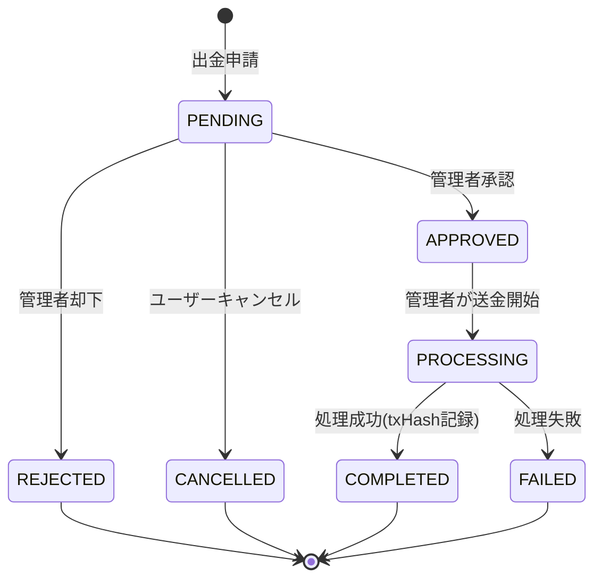

# Withdrawals

> Notion Source: https://www.notion.so/30f541c604348155bc45ff39aaf93c44

## 概要

ユーザーの残高を外部に出金するドメイン。連携済みのIzakaya Walletに出金される。管理者の承認が必要。

---

## ユースケース

### W-02 出金申請の作成
- **目的：** ユーザーが数量入力して申請
- **前提：** Userログイン済み、KYC=APPROVED、Wallet接続済み、出金停止OFF
- **勝利フロー**
  1. ユーザーが `amount_atomic` を入力して出金申請を送信（任意で冪等キー）
  2. サーバーがKYC状態（APPROVED）を確認
  3. サーバーがWallet接続状態と出金先アドレス（Polygon）を確認
  4. サーバーが金額を検証（>0、最小単位、最低出金額1,000円、1日上限、ランク別手数料を算出）
  5. サーバーが台帳（Ledger）から利用可能残高を算出し、残高>=amount を確認（BEが最終責任）
  6. Withdrawal を `PENDING` で作成
     - 出金先アドレスをスナップショットとして保存（推奨）
  7. 作成結果（status=PENDING、amount、fee、destination）を返す
- **例外フロー**
  - KYC未承認：403
  - Wallet未連携：409
  - 残高不足：422
  - 最低出金額未満：422
  - 出金停止ON：503
  - 冪等キー重複：同一結果を返す（推奨）または409（方針固定）
- **結果：** Withdrawal（PENDING）が作成される

---

### W-03 出金申請の承認/却下
- **目的：** 管理者が審査
- **前提：** Adminログイン済み、対象申請が `PENDING`、出金停止OFF
- **勝利フロー（承認）**
  1. 管理者が対象申請を選択し「承認」を実行
  2. サーバーがステータスが `PENDING` であることを確認（二重承認防止）
  3. Withdrawal を `APPROVED` に更新し、承認者・承認日時を記録
  4. （任意）WithdrawalApproval を作成（decision=APPROVE）
  5. 監査ログに記録
  6. 更新結果を返す
- **勝利フロー（却下）**
  1. 管理者が「却下」を実行し `reject_reason` を入力して送信
  2. サーバーがステータスが `PENDING` であることを確認
  3. Withdrawal を `REJECTED` に更新し、理由・却下者・却下日時を記録
  4. （任意）WithdrawalApproval を作成（decision=REJECT）
  5. 監査ログに記録
  6. 更新結果を返す
- **例外フロー**
  - `PENDING` 以外の申請を承認/却下：409
  - `reject_reason` 未入力：422
  - 出金停止ON：503
- **結果：** Withdrawal が APPROVED/REJECTED となり、理由と監査ログが残る

---

### W-04 送金Tx登録とステータス反映
- **目的：** 手動送金後、TxHash/結果を記録
- **前提：** Adminログイン済み、対象申請が `APPROVED`（または `PROCESSING`）、出金停止OFF
- **勝利フロー**
  1. 管理者が手動で Izakaya Wallet 宛に送金（Polygon）
  2. `tx_hash` と `result`（SUCCESS/FAILED）を取得
  3. 管理画面でTx登録を実行（withdrawal_request_id, tx_hash, result, sent_at任意）
  4. サーバーが申請状態が `APPROVED`（または `PROCESSING`）であることを確認
  5. サーバーが `tx_hash` の一意性を確認
  6. TransferTx を作成（tx_hash, network=POLYGON, result, recorded_by_admin_id 等）
  7. Withdrawal を `COMPLETED`（成功）または `FAILED`（失敗）へ更新
  8. 監査ログに記録
  9. 更新後の申請情報とTx情報を返す
- **例外フロー**
  - 状態不正（APPROVED/PROCESSING以外）：409
  - tx_hash 重複：409
  - 出金停止ON：503
- **結果：** TransferTx が作成され、Withdrawal が COMPLETED/FAILED へ反映される

---

### W-05 出金による台帳反映
- **目的：** 出金申請〜完了/失敗までの残高整合を保つ
- **前提：** 残高管理は台帳（Ledger）が真実
- **勝利フロー**
  1. 出金申請時（`PENDING`）に残高を減少させる（ロック的な扱い）
     - LedgerEntry 記録（`WITHDRAWAL_CRYPTO`）
  2. `COMPLETED` 時は追加の台帳操作なし

---

## 出金制限

| 項目 | 値 |
|------|---|
| 最小出金額 | 1,000円 |
| 1日上限 | 100万円（暗号資産 合算） |
| 1回上限 | なし（1日上限に従う） |
| 手数料 | ランクごとに異なる（下表参照） |

### 出金手数料（ランク別・マスター管理）

| ランク | 手数料 |
|--------|-------|
| Member | TBD |
| Silver | TBD |
| Gold | TBD |

- 手数料はマスター管理とし、Adminが管理画面から変更可能
- 手数料は出金額から差し引く（ユーザー受取額 = 出金申請額 - 手数料）
- 手数料変更は監査ログ対象

### 上限の計算
- 「1日」は **日本時間（JST）0:00〜23:59** を基準
- `PENDING`, `APPROVED`, `PROCESSING`, `COMPLETED` をカウント
- `REJECTED`, `CANCELLED`, `FAILED` はカウントしない

---

## 出金先の事前登録

### KYCゲート
- `kyc_status = APPROVED` のユーザーのみ出金申請可能
- KYC未完了ユーザーには出金申請UIを非表示（またはブロック）

### Wallet接続ゲート
- WalletConnection が `CONNECTED` 状態であること
- Phase1では `network = POLYGON` 固定（識別子は `address` のみ）
- `CONNECTED` でなければ出金申請不可

---

## 状態フロー

### 状態定義

| 状態 | 説明 |
|------|------|
| `PENDING` | ユーザーが申請、管理者の承認待ち |
| `APPROVED` | 承認済み（送金ジョブを作る前） |
| `PROCESSING` | 送金実行中（Izakaya Walletへ依頼済み / 送金Tx作成〜確認中） |
| `COMPLETED` | 出金完了（TxHash必須） |
| `REJECTED` | 管理者が却下（理由保持） |
| `CANCELLED` | ユーザーがキャンセル |
| `FAILED` | 処理失敗（エラー等、失敗理由保持） |

### 残高の扱い
- **PENDING時点**で残高を減少（ロック的な扱い）
- **REJECTED / CANCELLED / FAILED** で残高を戻す

### FAILEDからのリカバリ方針
- FAILED からの自動リトライパスは設けない
- ユーザーは新規に出金申請を作成する（残高はFAILED時に戻っている）

### ガード条件

| 遷移 | ガード条件 |
|------|-----------|
| `[*] → PENDING` | KYC=APPROVED, Wallet連携済み, 残高>=出金額, 最低出金額OK, 1日上限OK, 出金停止OFF |
| `PENDING → APPROVED` | 出金停止OFF |
| `PENDING → REJECTED` | reject_reason 必須 |
| `PENDING → CANCELLED` | ユーザー本人のみ |
| `APPROVED → PROCESSING` | 管理者が送金開始 |
| `PROCESSING → COMPLETED` | tx_hash 必須, result=SUCCESS |
| `PROCESSING → FAILED` | failure_reason 保持推奨 |

---

## 処理フロー

### 出金申請（トランザクション内）
1. バリデーション
   - KYCが `APPROVED`
   - Walletが `CONNECTED`
   - 残高 >= 出金額
   - 最低出金額（1,000円）チェック
   - 1日上限チェック
   - 出金停止OFF
2. 残高を減少
3. LedgerEntry 記録（`WITHDRAWAL_CRYPTO`）
4. Withdrawal 作成（`PENDING`）

### 承認（トランザクション内）
1. 出金停止OFFを確認
2. Withdrawal.status = `APPROVED`
3. Withdrawal.approved_by, approved_at 設定
4. 処理キューに追加

### 却下（トランザクション内）
1. 残高を戻す
2. LedgerEntry 記録（`WITHDRAWAL_REVERSAL`）
3. Withdrawal.status = `REJECTED`、reject_reason を保存

### キャンセル（トランザクション内）
1. 残高を戻す
2. LedgerEntry 記録（`WITHDRAWAL_REVERSAL`）
3. Withdrawal.status = `CANCELLED`

### 処理開始（トランザクション内）
1. Withdrawal.status = `PROCESSING`
2. Admin手動送金（Polygon）

### 処理完了（トランザクション内）
1. Withdrawal.status = `COMPLETED`
2. Withdrawal.tx_hash, completed_at 設定
3. ユーザーに通知

### 処理失敗（トランザクション内）
1. 残高を戻す
2. LedgerEntry 記録（`WITHDRAWAL_REVERSAL`）
3. Withdrawal.status = `FAILED`
4. Withdrawal.failure_reason 設定
5. ユーザーに通知

---

## 管理画面（見せたいもの）

### 出金申請一覧
- 状態別フィルタ（PENDING / APPROVED / PROCESSING / COMPLETED / REJECTED / CANCELLED / FAILED）
- ユーザー名 / 出金額 / 出金先アドレス / 申請日 / 承認者

### 出金詳細
- 申請情報（ユーザー / 出金額 / アドレス / ネットワーク）
- 状態履歴（遷移ログ）
- TxHash（COMPLETED時）/ 失敗理由（FAILED時）/ 却下理由（REJECTED時）

### 承認/却下操作
- PENDING一覧からの承認・却下
- 却下時はreject_reason入力必須

### 送金操作
- APPROVED一覧からの処理開始
- PROCESSING一覧でのTxHash記録・完了/失敗更新

---

## 通知

| イベント | ユーザー通知 |
|---------|-------------|
| 出金申請受付 | アプリ内 |
| 承認 | アプリ内 |
| 却下 | アプリ内（理由付き） |
| 完了 | アプリ内 |
| 失敗 | アプリ内（理由付き） |

---

## 不変条件（Invariants）

1. **残高整合性**: PENDING時に残高減少、REJECTED/CANCELLED/FAILEDで戻す
2. **TxHash必須**: COMPLETED の根拠は TxHash 必須
3. **KYCゲート**: `kyc_status != APPROVED` のユーザーは出金申請不可
4. **Walletゲート**: `CONNECTED` でないユーザーは出金申請不可
5. **出金停止チェック**: 出金停止ON時は新規申請・承認を不可

---

## 決定済み事項

- 管理者1人の承認が必要
- 承認期限なし（手動対応のみ）
- 最小出金額: 1,000円
- 1日上限: 100万円（暗号資産 合算）
- 手数料: ランクごとに異なる（マスター管理、Admin変更可能）
- FAILEDからの自動リトライは設けない（ユーザーが新規申請）
- Phase1はPolygon固定、Izakaya Walletのみ
