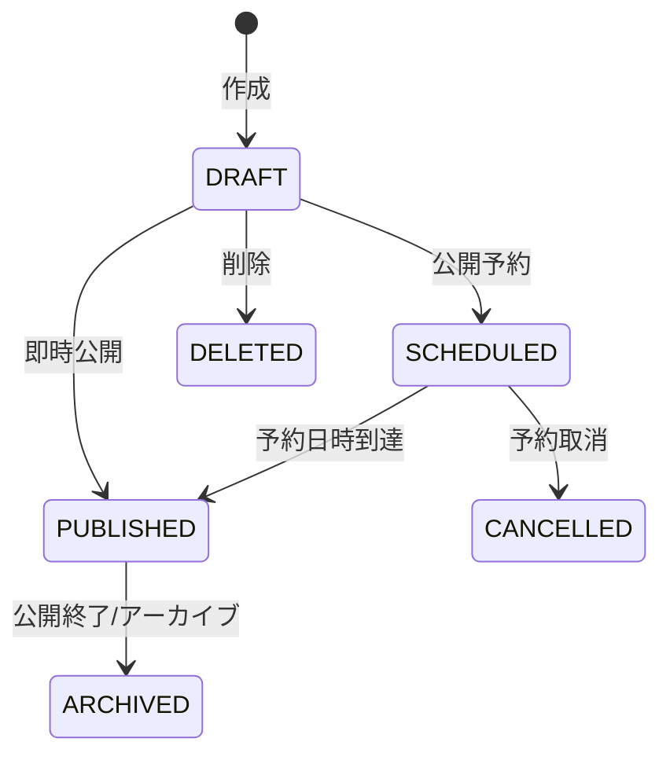
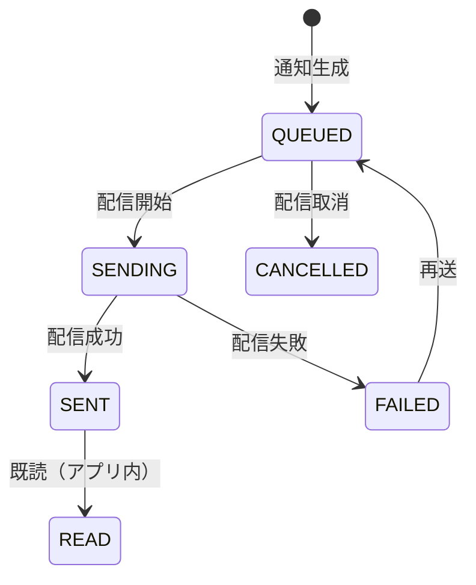

# Notifications and CMS

> Notion Source: https://www.notion.so/30f541c604348182aa79f3a85d4b5965

## 概要

運営が作成する「お知らせ/コンテンツ（CMS）」を管理し、必要に応じてユーザーへ「通知（Notifications）」として配信するドメイン。
基本思想は **CMS＝中身、Notifications＝届け方**。

---

### N-01 システム通知（全体向け）作成
- **目的**：メンテ/キャンペーン等のお知らせ作成
- **前提**：Adminログイン済み
- **勝利フロー**
  1. 管理者がお知らせの `title/body/category` を入力して送信
  2. サーバーが必須項目・長さ等を検証
  3. ContentItem を `DRAFT` として作成（`published_at` は未設定または将来日時）
  4. 監査ログに「作成」を記録
  5. 作成結果（id、draft状態）を返す
- **例外フロー**
  - 入力不正：422
  - 権限不足：403
- **結果**：ContentItem（DRAFT）が作成される（公開前）

---

### N-02 システム通知の予約公開/公開
- **目的**：publishedAtで公開制御
- **前提**：Adminログイン済み、対象が公開前（DRAFT/SCHEDULED）
- **勝利フロー（即時公開）**
  1. 管理者が「公開」を実行
  2. サーバーが対象が公開可能状態であることを確認
  3. `published_at = now()` を設定し `PUBLISHED` にする
  4. 監査ログに「公開」を記録
  5. 更新結果を返す
- **勝利フロー（予約公開）**
  1. 管理者が `published_at`（未来日時）を指定して「予約公開」を実行
  2. サーバーが日時形式と未来日時であることを検証
  3. `published_at` を保存し `SCHEDULED` とする
  4. 監査ログに「予約」を記録
  5. 更新結果を返す
  6. `published_at` 到達後、ユーザー表示対象になる（自動反映）
- **例外フロー**
  - 公開済みを再度公開/予約：409
  - `published_at` 形式不正：422
  - 権限不足：403
- **結果**：公開対象としてユーザーに表示される（published_at <= now のみ表示）

---

### N-03 お知らせ一覧/詳細取得（ユーザー）
- **目的**：アプリ内で履歴閲覧
- **前提**：Userログイン済み
- **勝利フロー（一覧）**
  1. ユーザーが「お知らせ一覧」を開く
  2. サーバーが `published_at <= now` のものだけ取得（未公開は除外）
  3. ページング・ソート（例：published_at desc）に従って返す
- **勝利フロー（詳細）**
  1. ユーザーが特定のお知らせを開く（id指定）
  2. サーバーが公開済みであることを確認し詳細を返す
- **例外フロー**
  - 存在しない：404
  - 未公開のIDをUserが指定：404（または403、方針固定）
- **結果**：一覧/詳細が表示できる

---

### N-04 既読管理（任意）
- **目的**：未読件数/バッジ表示
- **前提**：既読管理を採用する（NotificationReadを使う）
- **勝利フロー（既読）**
  1. ユーザーがお知らせ/通知の詳細を開く（または「既読」操作）
  2. サーバーが `(notification_id, user_id)` の NotificationRead を作成（既にあれば作らない）
  3. 既読状態を返す
- **勝利フロー（未読数）**
  1. ユーザーが未読数取得（または一覧取得）を行う
  2. サーバーが「公開済み通知 - 既読レコード」を計算して未読数を返す
- **例外フロー**
  - 他人宛（個別通知の場合）：403
- **結果**：NotificationReadが作成され、未読数計算が可能になる

---

### N-05 個別通知の生成（任意）
- **目的**：出金承認/却下/完了などの通知を自動生成
- **前提**：個別通知を採用する（Notification(type=INDIVIDUAL)を使う）
- **勝利フロー（生成）**
  1. 他ドメインでイベントが発生（例：出金 `APPROVED/REJECTED/COMPLETED/FAILED`）
  2. サーバーが対象ユーザーを特定し、通知内容（category/title/body）を生成
  3. Notification(type=INDIVIDUAL, target_user_id=必須) を作成
  4. （任意）reference_type/reference_id（例：withdrawal_request_id）を保存し追跡可能にする
  5. （任意）メール送信等の補助チャネルを実行
- **例外フロー**
  - 対象ユーザーが無効（退会/BAN等）：通知を作らない/作る（方針固定）
- **結果**：Notification（INDIVIDUAL）が作成され、ユーザーが履歴として閲覧できる

---

## 配信チャネル（MVP）
- アプリ内通知（In-app）：必須
- Push / Email：Phase2（必要になったら追加）

---

## CMS（コンテンツ管理）

### コンテンツ種別（例）
- お知らせ（News）
- キャンペーン告知（Campaign Notice）
- メンテナンス（Maintenance）
- 重要（Important）

### 公開対象（セグメント）
- 全ユーザー
- ランク別
- キャンペーン参加者
- 特定ユーザー（user_id指定）
- 登録日コホート（任意）

---

## CMSの状態フロー（ContentItem）

### 状態定義

| 状態 | 説明 |
|------|------|
| `DRAFT` | 下書き（非公開） |
| `SCHEDULED` | 公開予約（予約日時が来たら公開） |
| `PUBLISHED` | 公開中（アプリ内で表示対象） |
| `ARCHIVED` | 公開終了（履歴として保持） |
| `CANCELLED` | 予約を取り消した |
| `DELETED` | 削除（MVPは物理削除でも可、監査重視なら論理削除） |

---

## Notifications（通知配信）

### 通知イベント（例）
- CMS公開（PUBLISHED）に連動して通知を作る
- 取引/報酬/出金など他ドメインのイベントでも通知を作る（将来）

---

## 通知の状態フロー（Notification）

### 状態定義

| 状態 | 説明 |
|------|------|
| `QUEUED` | 配信待ち（対象ユーザー確定済み） |
| `SENDING` | 配信中 |
| `SENT` | 配信成功（少なくともアプリ内に生成済み） |
| `FAILED` | 配信失敗（失敗理由保持、必要なら再送） |
| `CANCELLED` | 配信取消（誤配信防止） |
| `READ` | 既読（アプリ内通知のみ） |

---

## 処理フロー

### 1) CMS作成〜公開（トランザクション内）
1. Content作成（`DRAFT`）
2. バリデーション
   - title/body必須
   - 公開対象（セグメント）必須
3. 公開方法を選択
   - 即時公開：`PUBLISHED`
   - 予約：`SCHEDULED`（`publish_at`必須）

### 2) 公開と通知の連動（トランザクション内）
- Contentが `PUBLISHED` になった時に、通知設定がONなら
  1. Notificationを生成（`QUEUED`）
  2. 対象ユーザーを確定（セグメント解決）
  3. 配信ジョブへ投入

※「CMSは公開したいが通知は飛ばしたくない」ケースが必ずあるので、Contentに `notify_on_publish` を持たせる（または公開時に選択）想定が安全。

### 3) 配信（ワーカー処理）
1. `QUEUED` を取得 → `SENDING`
2. アプリ内通知を対象ユーザーへ生成（またはユーザー別通知レコード作成）
3. 成功で `SENT`、失敗で `FAILED`（エラー詳細保持）
4. 必要なら再送（`FAILED → QUEUED`）

### 4) 既読（ユーザー操作）
- ユーザーが通知を開いたら `READ` を付与（アプリ内のみ）

---

## 管理画面（見せたいもの）

### CMS
- Content一覧（状態 / 種別 / 公開期間 / セグメント / 作成者）
- 作成/編集（DRAFT）
- 公開・予約・取消・アーカイブ
- プレビュー（公開時の見え方）

### Notifications
- 通知一覧（状態 / チャネル / 対象数 / 成功数 / 失敗数）
- 失敗理由の確認、再送、配信取消
- 対象ユーザーのサンプル表示（「誰に飛ぶか」の確認）

---

## 不変条件（Invariants）

1. **重複配信防止**：同一イベント（例：content_id）に対して同一ユーザーへ二重通知しない
2. **セグメント確定**：配信対象は `QUEUED` の時点で確定（後からユーザー属性が変わっても原則ブレない）
3. **公開と通知は別**：Content公開はできるが通知は任意（誤配信防止）
4. **監査**：重要操作（公開/取消/再送）は `_by_admin_id` と時刻を保持

---

## 決定済み事項

- アプリ内通知は実装する
- CMS公開と通知は連動可能（ただしON/OFFできる）
