# 状態遷移

各ドメインの状態遷移図

---

## User（ユーザーアカウント）

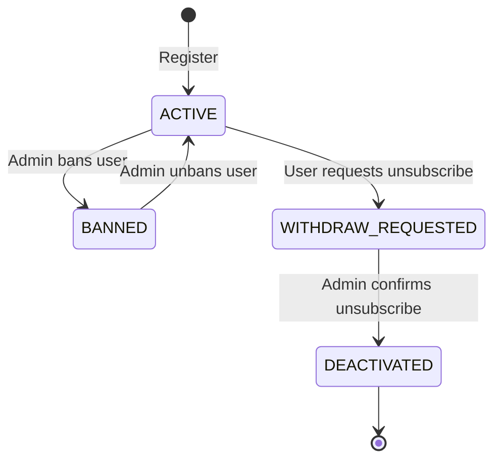

### 状態定義

| 状態 | 説明 |
|------|------|
| `ACTIVE` | 通常利用可能 |
| `BANNED` | 管理者による利用停止（主要操作禁止） |
| `WITHDRAW_REQUESTED` | ユーザーが退会申請済み、管理者の確認待ち |
| `DEACTIVATED` | 退会確定（ログイン不可） |

---

## AdminUser（管理者アカウント）

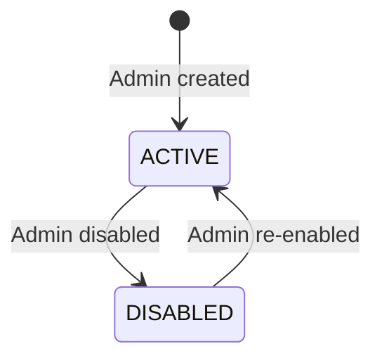

---

## WalletConnection（ウォレット接続状態）

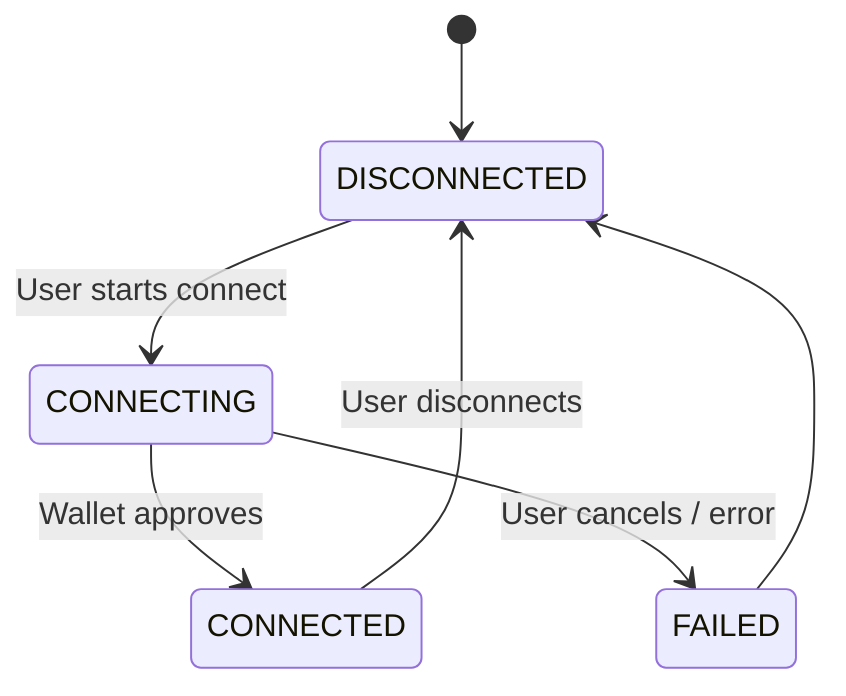

---

## Broker Integration and Account Linking（口座連携申請）

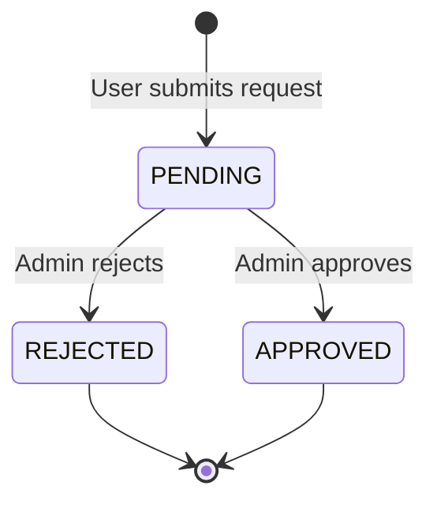

---

## Withdrawals（出金）

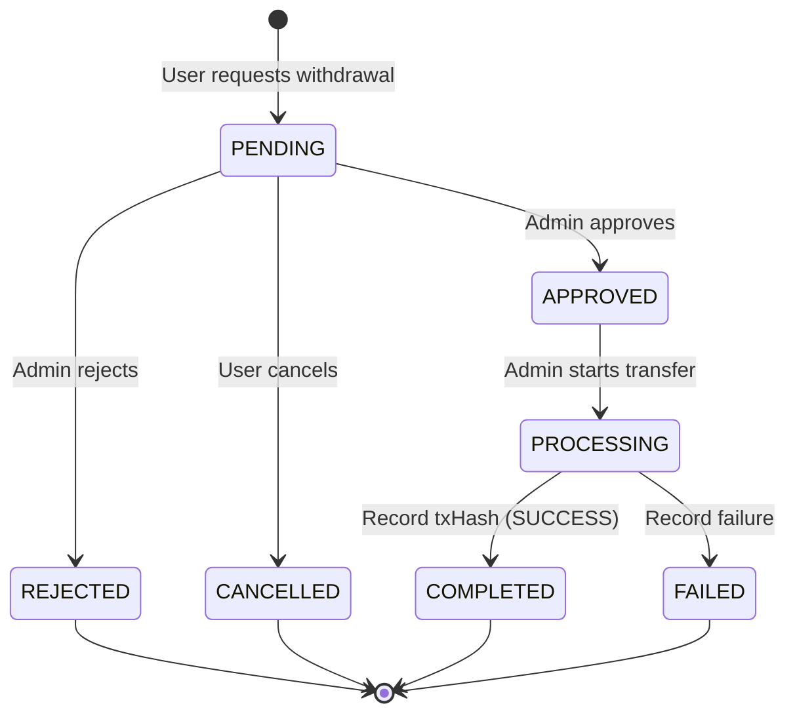

### 状態定義

| 状態 | 説明 |
|------|------|
| `PENDING` | ユーザーが申請、管理者の承認待ち |
| `APPROVED` | 承認済み（送金ジョブを作る前） |
| `PROCESSING` | 送金実行中（Izakaya Walletへ依頼済み / 送金Tx作成〜確認中） |
| `COMPLETED` | 出金完了（TxHash必須） |
| `REJECTED` | 管理者が却下（理由保持） |
| `CANCELLED` | ユーザーがキャンセル |
| `FAILED` | 処理失敗（エラー等、失敗理由保持） |

### ガード条件

| 遷移 | ガード条件 |
|------|-----------|
| `[*] → PENDING` | KYC=APPROVED, Wallet連携済み, 残高>=出金額, 最低出金額OK, 1日上限OK, 出金停止OFF |
| `PENDING → APPROVED` | 出金停止OFF |
| `PENDING → REJECTED` | reject_reason 必須 |
| `PENDING → CANCELLED` | ユーザー本人のみ |
| `APPROVED → PROCESSING` | 管理者が送金開始 |
| `PROCESSING → COMPLETED` | tx_hash 必須, result=SUCCESS |
| `PROCESSING → FAILED` | failure_reason 保持推奨 |

### 残高の扱い

- **PENDING時点**で残高を減少（ロック的な扱い）
- **REJECTED / CANCELLED / FAILED** で残高を戻す

### FAILEDからのリカバリ方針

- FAILED からの自動リトライパスは設けない
- ユーザーは新規に出金申請を作成する（残高はFAILED時に戻っている）

---

## TradeImport（CSV取込）

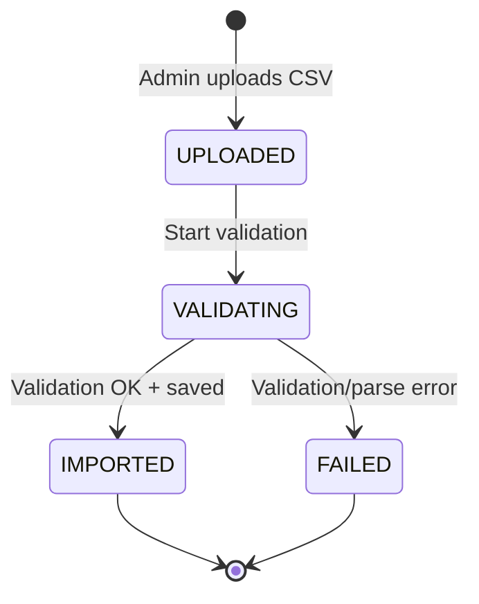

### ガード条件

| 遷移 | ガード条件 |
|------|-----------|
| `[*] → UPLOADED` | ブローカーが有効（`is_active=true`）、ファイル形式がCSV |
| `UPLOADED → VALIDATING` | 自動遷移（アップロード後に即時開始） |
| `VALIDATING → IMPORTED` | CSV構造OK、必須列OK、紐付け済み行でユーザー別原資R確定済み（未紐付け行は除外してログ記録）、二重取込チェック通過 |
| `VALIDATING → FAILED` | パースエラー、必須列欠落、紐付け未解決、重複検出 |

---

## RewardCalculationRun（付与計算実行）

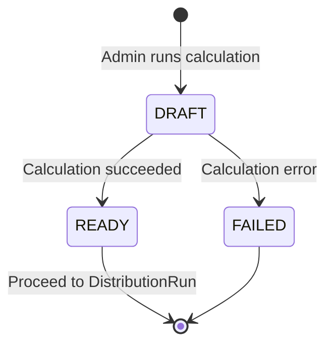

### 状態定義

| 状態 | 説明 |
|------|------|
| `DRAFT` | 計算実行中 |
| `READY` | 計算完了、プレビュー確認可能 |
| `FAILED` | 計算失敗（failure_reason 保持） |

### ガード条件

| 遷移 | ガード条件 |
|------|-----------|
| `[*] → DRAFT` | 対象月の原資R確定済み |
| `DRAFT → READY` | 計算成功、整合性チェック通過（BR-08） |

---

## DistributionRun（付与実行：確定単位）

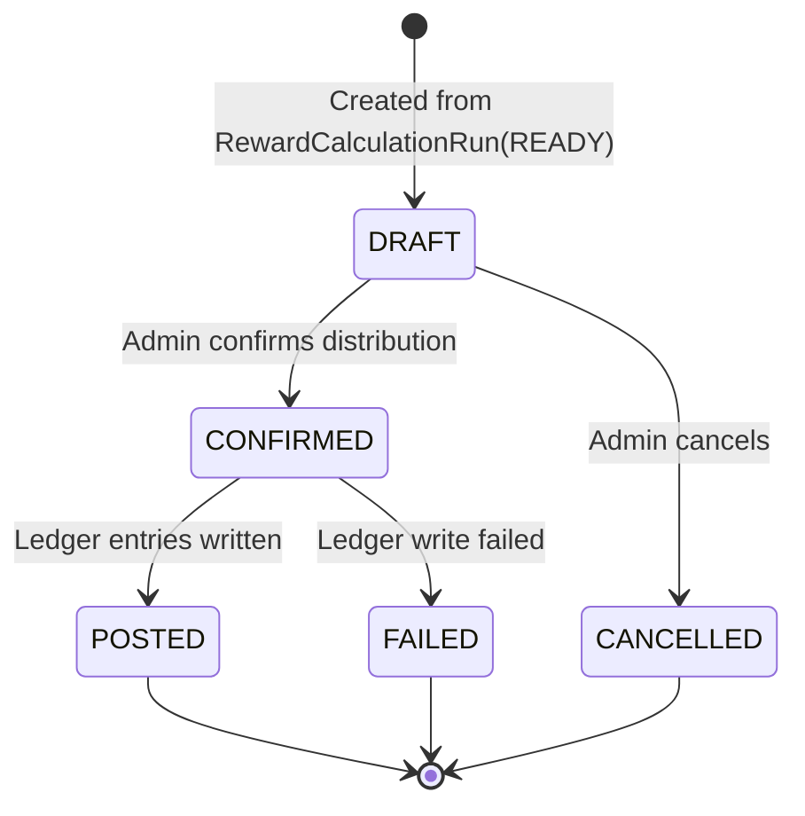

### ガード条件

| 遷移 | ガード条件 |
|------|-----------|
| `[*] → DRAFT` | RewardCalculationRun.status = READY |
| `DRAFT → CONFIRMED` | 付与停止OFF, 二重付与防止キーチェック通過 |
| `CONFIRMED → POSTED` | 全LedgerEntry書込成功 |
| `CONFIRMED → FAILED` | LedgerEntry書込失敗（ロールバック） |

---

## ContentItem（CMS コンテンツ）

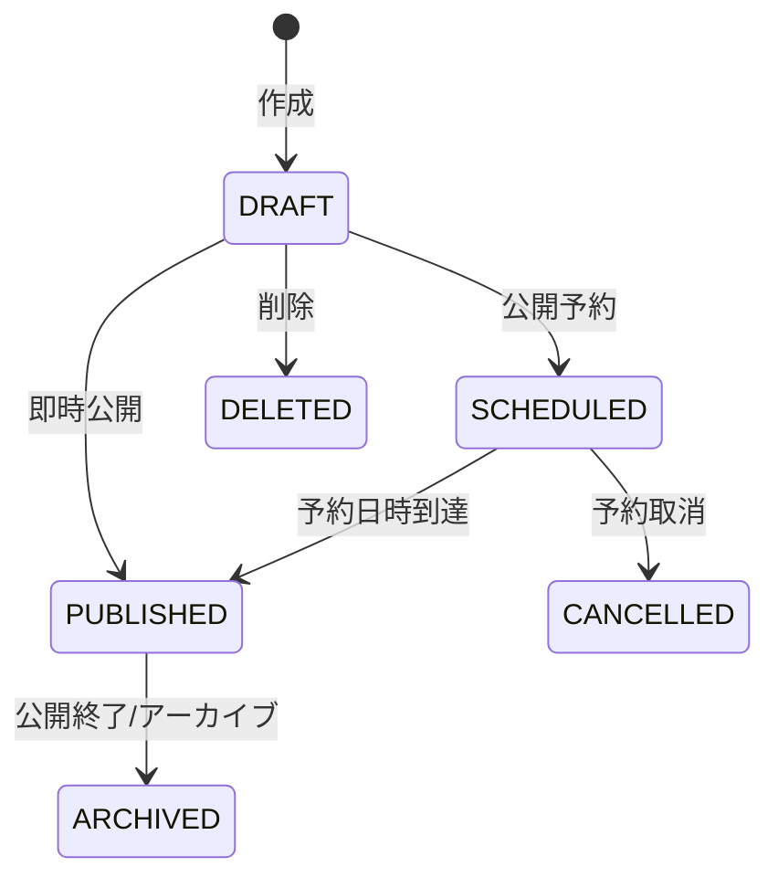

### 状態定義

| 状態 | 説明 |
|------|------|
| `DRAFT` | 下書き（非公開） |
| `SCHEDULED` | 公開予約（予約日時が来たら公開） |
| `PUBLISHED` | 公開中（アプリ内で表示対象） |
| `ARCHIVED` | 公開終了（履歴として保持） |
| `CANCELLED` | 予約を取り消した |
| `DELETED` | 削除（MVPは物理削除でも可、監査重視なら論理削除） |

---

## Notification（通知配信）

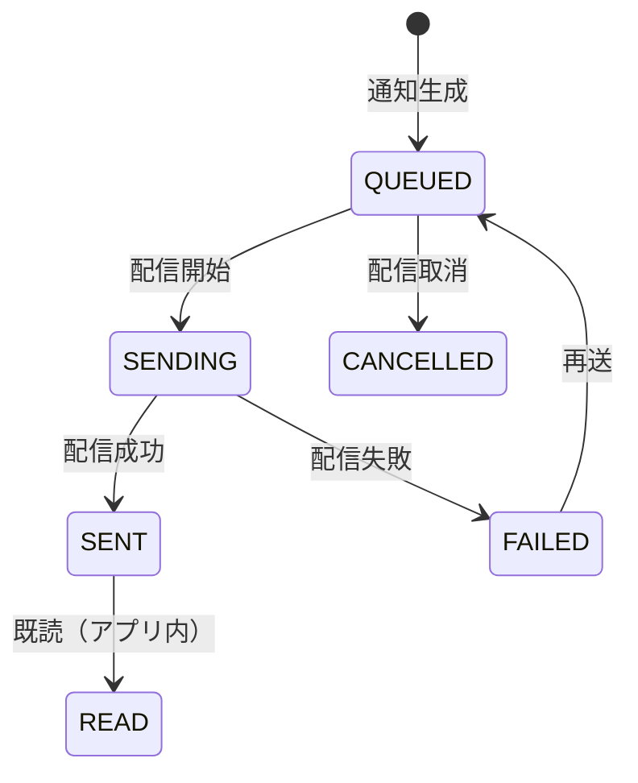

### 状態定義

| 状態 | 説明 |
|------|------|
| `QUEUED` | 配信待ち（対象ユーザー確定済み） |
| `SENDING` | 配信中 |
| `SENT` | 配信成功（少なくともアプリ内に生成済み） |
| `FAILED` | 配信失敗（失敗理由保持、必要なら再送） |
| `CANCELLED` | 配信取消（誤配信防止） |
| `READ` | 既読（アプリ内通知のみ） |

---

## KYC状態

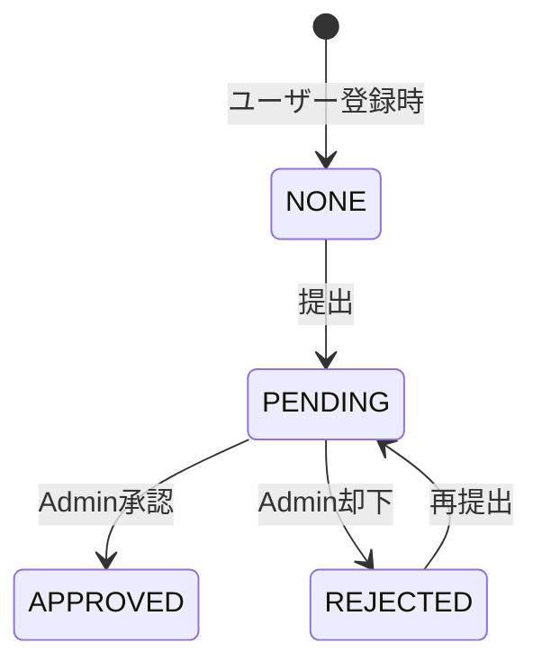

### 状態定義

| 状態 | 説明 |
|------|------|
| `NONE` | 未提出 |
| `PENDING` | 提出済み・審査中 |
| `APPROVED` | 承認済み（出金申請可能） |
| `REJECTED` | 却下（理由保持、再提出可能） |

---

## FXAccount（連携済み口座）

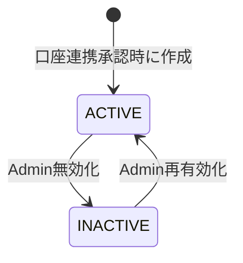

### 状態定義

| 状態 | 説明 |
|------|------|
| `ACTIVE` | 有効（取引集計・付与計算の対象） |
| `INACTIVE` | 無効（集計・計算の対象外） |

---

## LedgerEntry（台帳エントリ）

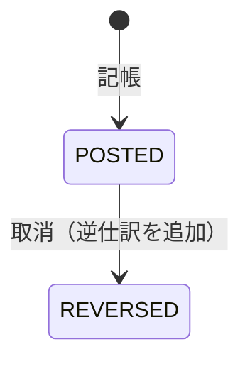

### 状態定義

| 状態 | 説明 |
|------|------|
| `POSTED` | 記帳済み（残高に反映される） |
| `REVERSED` | 取消済み（逆仕訳が追加された状態） |

- 台帳は**追記のみ**（削除・編集不可）
- 取消は逆仕訳で表現する

---

## Platform Ops（緊急停止スイッチ）

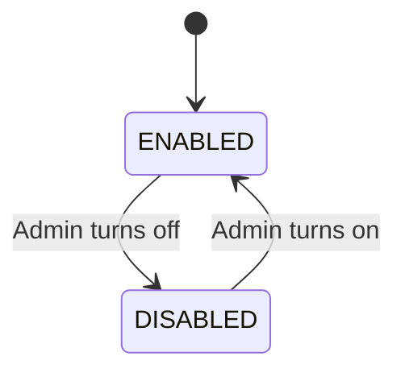

---

Source: https://www.notion.so/313541c60434808fa499e400e54de548
